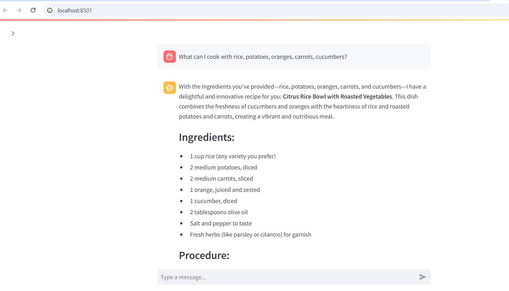

# Personalized Recipe Generator

## Description

### Problem
In today’s fast-paced world, people often find themselves with random leftover ingredients but limited time or inspiration to figure out how to use them effectively. Traditional recipe apps typically retrieve and display existing recipes, which may not always align with the specific ingredients on hand or user preferences. Additionally, many recipe platforms fail to cater to personalized dietary needs, preferences, or restrictions, which limits their usefulness to diverse users.

Moreover, food waste is a growing concern globally, and individuals often struggle to use what they already have before it spoils. A lack of creative or customized options for leftover ingredients results in unnecessary food waste and missed opportunities for healthier, personalized meals. What’s missing is an intelligent, tailored solution that dynamically creates new and original recipes based on the exact ingredients a user has.

### Project Objectives:
1. **Develop a Personalized Recipe Generator** - by leveraging the concept of Retrieval-	Augmented Generation (RAG) the aim here is to have system that generates new, 	customized recipes for users based on the ingredients they input. The application goes 	beyond simply retrieving existing recipes from a database; instead, it uses knowledge 	from existing recipe datasets and combines that with generative capabilities to craft 	entirely new, tailored recipes.

2. **Identification of a Comprehensive Dataset & Data Handling**
	* Selected Dataset:* The dataset exploited in this project is [RecipeNLG](https://www.kaggle.com/datasets/saldenisov/recipenlg) that is available on Kaggle. The dataset is rich in recipes, including ingredients, procedures, and named entity recognition (NER) for key elements.
	* Pre-processing: The selected dataset is extremely comprehensive with 2.2GB in size. This extremely huge dataset is not feasible to train on local computers. For this reason, a randomly selected subset of 50000 recipes has been extracted from the 1M+ recipes and the subset is used in this project.

3. **Implementation of the RAG Flow** - enabling a large language model (LLM) system to 	query structured data differs significantly from querying unstructured text data. While 	unstructured data typically involves generating text that can be searched in a vector 	database, querying structured data often requires the LLM to generate and execute 	queries in a domain-specific language (DSL), such as structured query language (SQL).
	In this project, the selected dataset is available in a CSV file. For this reason, the RAG flow is implemented as a ***text-to-SQL chain*** using the LangChain framework.

4. **RAG Evaluation** - evaluating a RAG application is essential to ensure the accuracy, 	relevance, and quality of the generated content while balancing effective retrieval and 	generation processes. It improves user experience by personalizing outputs, ensures 	efficiency in real-time applications, and identifies edge cases to enhance reliability. 	Additionally, it helps optimize performance, resource usage, and costs, providing a 	feedback loop for ongoing improvements in model design and consistency. Overall, 	evaluation is crucial for delivering a reliable, high-quality system that meets user 	needs effectively.
	In this project, the concept of online RAG evaluation has been exploited. It means that the output of the LLM generated in the application is evaluated on-the-go, when the application is running. Different evaluation criteria such as
	* answer helpfulness,
	* answer precision,
	* LLM hallucination,
	* LLM guardrails, and
	* user feedback

	have been utilized for evaluating the generated LLM output. It is worth-mentioning that this evaluation is carried out in the ***LLM-as-a-Judge*** setting.

5. **LLM RAG Application Monitoring** The output of the LLM RAG app as evaluated in step #4 	is monitored in step #5. In addition, information about 
	* the total number of tokens, 
	* tokens per trace, 
	* tokens per LLM calls,
	* total cost,
	* cost per trace,
	* cost per LLM calls,
	* total number of LLM calls,
	* LLM calls per trace,
	* tokens per second

	are just to name a few plots that are available for monitoring.

### Tools & Technologies

- Cloud - [**Amazon Web Services**](https://aws.amazon.com/)
- Containerization - [**Docker**](https://www.docker.com) and [**Docker Compose**](https://docs.docker.com/compose/)
- Database - [**MySQL**](https://www.mysql.com/)
- Workflow Orchestration - [**Prefect**](https://www.prefect.io/)
- Framework for LLMs Integration into Applications - [**LangChain**](https://www.langchain.com/)
- Framework for Interactive Data Applications - [**Streamlit**](https://streamlit.io/)
- LLM RAG Application Monitoring - [**LangSmith**](https://smith.langchain.com/)
- Language - [**Python**](https://www.python.org) 

### Architecture

### Exploratory Data Analysis and Initial Model Training
The exploratory data analysis and initial model training is done in Jupyter a notebook. This notebook is available in the `exploratory_data_analysis` directory. [Setup](setup/exploratory_data_analysis.md).

### Personalized Recipe Generator (LLM RAG Application)

## Setup

**WARNING: You will be charged for using OpenAI models.**

### Pre-requisites

### Get Going

- Setup for running the application locally - [Setup](setup/local_project_setup.md)

### Further Improvement

TDB

### Special Mentions
I'd like to acknowledge the efforts of the [DataTalks.Club](https://datatalks.club) team for offering this LLM course at absolutely no costs. There is no doubt about it that I have learnt a lot. This hands-on project enabled me to apply what I learnt during the course. [LLM Zoomcamp](https://github.com/DataTalksClub/llm-zoomcamp) a highly recommended course to everybody who is interested in developing their skills in LLMs. 