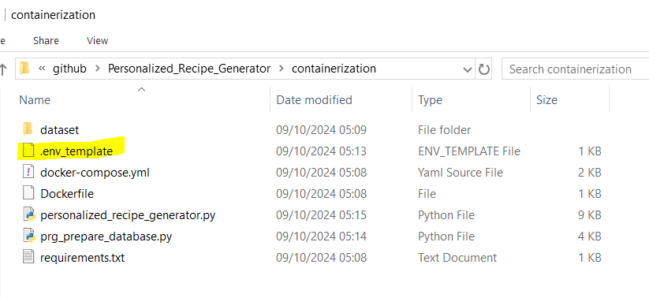

## Containerizaing LLM RAG Application

Make sure `docker` and `docker-compose` are installed on your local machine.

Change directory to `containerization`, i.e., 

```
cd ~/personalized_recipe_generator/containerization
```

In `containerization`, there exists a file named `.env_template` (refer to the folder screenshot).



Rename this template file to `.env`. In addition, insert the correct API keys in this file. 

***Docker:*** Trigger the Text-to-SQL LLM RAG application from Docker

- Open a new terminal and make sure that you are in `personalized_recipe_generator/containerization`. From inside `personalized_recipe_generator/containerization`, run the command below to build the docker image from docker-compose

	```
	docker-compose up --build
	```

- When Docker image is built successfully, it will give access to streamlit's localhost, i.e., [http://localhost:8501](http://localhost:8501). Go to this URL and use the application as per your linking and convenience.