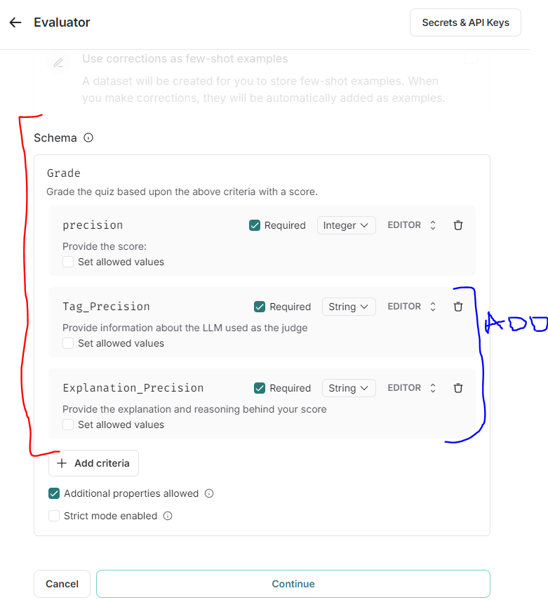
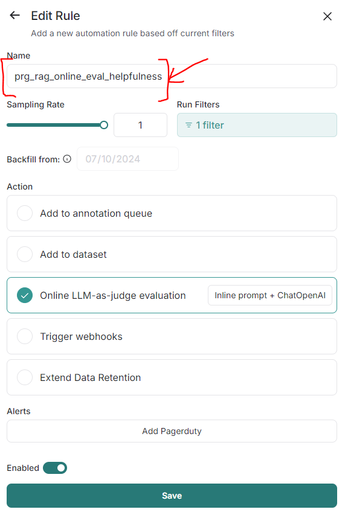
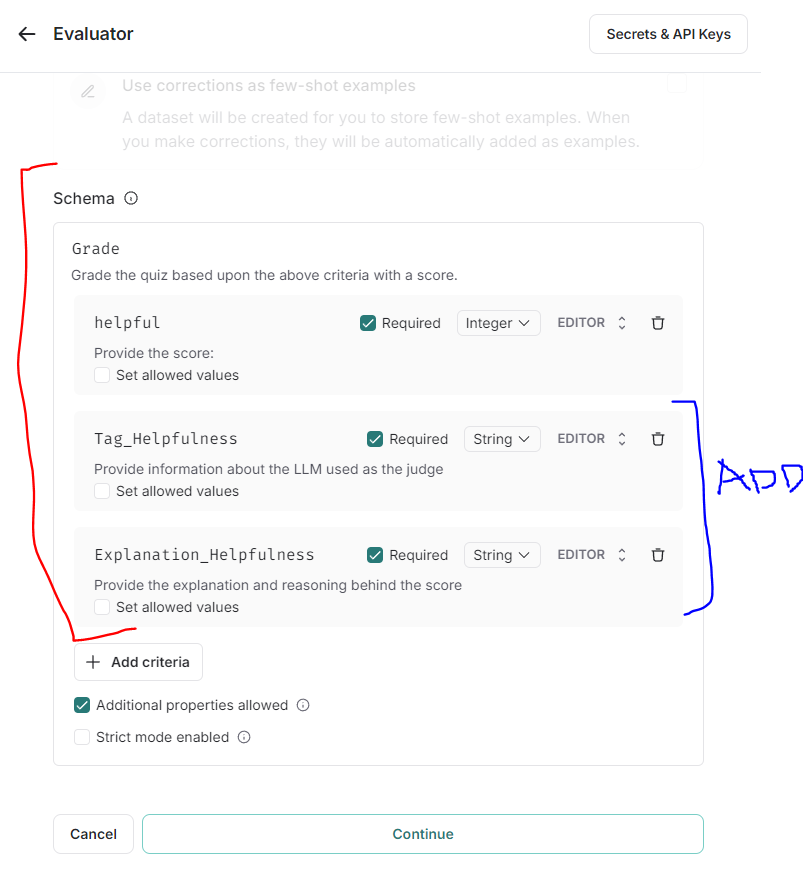

## LLM RAG Application Monitoring

[**LangSmith**](https://smith.langchain.com/) has been exploited in this project for online evaluating and monitoring the RAG application. There are a few steps that need to be followed for setting up the evaluation and monitoring of the RAG application.

1. As a first step, go to [https://smith.langchain.com/](https://smith.langchain.com/) and register yourself there if you have not already done that.
2. Go to Settings of your account to generate the API key, which is required for gathering the traces/ runs of the RAG application to be evaluated.
3. As mentioned in [Setup](setup/local_project_setup.md), you have to add the generated `LANGCHIAN_API_KEY` to the `.evn` file.
4. Run the application once or a couple of times as mentioned in [Setup](setup/local_project_setup.md).
5. Go to [https://smith.langchain.com/](https://smith.langchain.com/).LangSmith's landing page looks something like 
Depending upon if you have used LangSmith before or if it is the first time you are using it, you will see 1 or more projects under the ***Projects*** tab as encircled in this figure. 
6. Go ahead and click on the ***Projects*** tab to browse through the list of available projects in your account (a screenshot attached for ready reference ).
7. If you have correctly added `LANGCHAIN_API_KEY` in the `.env` file, the run of the application would create the project ***PRG RAG App Eval Experiments*** in your LangSmith account. Click on the project to start exploring the traces, setting up rules for evaluation, and monitoring different stats as well as metrics. The list of traces in the project looks like .
8. At this time, we need to setup some rules of evaluation for the project. This can be done by click the button entitled ***Rules*** on top left corner besides the ***Stats*** panel (refer to the figure include in item #7 on this list). Clicking on the ***Rules*** button will open a separate panel as shown in . In the presented screenshot, you can see that there are four rules setup for this RAG evaluation project. For you, this list would be empty and therefore, you should click on the ***Add Rule*** button.
9. The ***Add Rule*** button will open yet another panel as displayed in . On this panel 
	* Select ***Online LLM-as-judge evaluation*** and
	* Click on ***Create evaluatior***
10. The ***Create evaluatior*** button will take you to the panel as shown in . Here the selection of interest is under ***Prompt***, i.e., ***Try a suggested Evaluator Prompt***. Feel free to experiment with the ***Judge*** or keep the default settings in tact.
11. Trying out a suggested evaluator prompt will give you the following 5 options to choose from, i.e.,
	* Hallucination,
	* Document Relevance Recall,
	* Document Relevance Precision,
	* Answer Helpfulness, and
	* Tagging

	An overview of the evaluator prompts available from LangSmith is included in the screenshot  for ready reference.
	In this project, except from *Document Relevance Recall* all the remaining four evaluator have been set up and utilized.

*Note: When you set up the project rules for the very first time, LangSmith will prompt you to provide the LANGHAIN_API_KEY.*  

#### Add Rule - Guardrails (Tagging)
After following steps 1 - 11 in the previous section, please set up the guardrails evaluator prompt as presented in the next three figures. Please note that guardrails mean that if you enter any personal information, threats, insults, and/ or highly negative comments, then it will be flagged by our guardrails evaluator.

#### Add Rule - Document Relevance Precision
Please set up the document relevance precision evaluator prompt as presented in the next three figures.

#### Add Rule - Answer Helpfulness
Please set up the answer helpfulness evaluator prompt as presented in the next three figures.

#### Add Rule - Hallucination
Please set up the hallucination evaluator prompt as presented in the next three figures.

